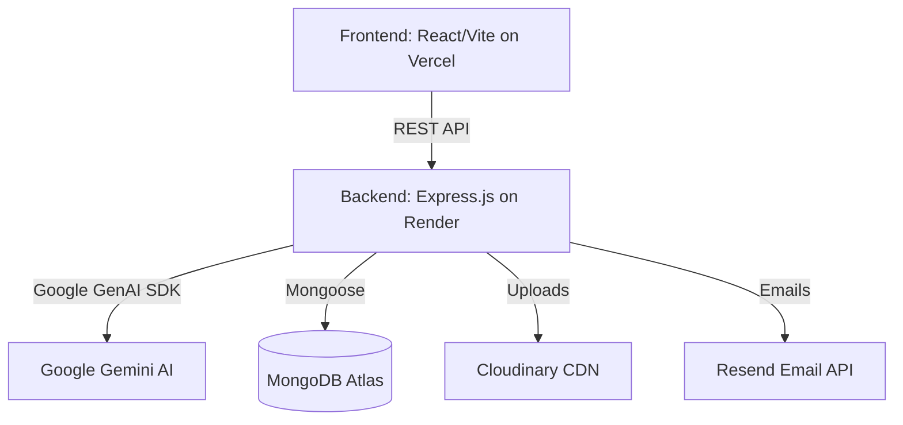

# BookGenie AI 🧞‍♂️📖

> **Live Demo:** [https://bookgenie-ai.vercel.app](https://bookgenie-ai.vercel.app)

<video src="./assets/demo.mov" controls="controls" width="100%">
  Your browser does not support the video tag.
</video>

<div align="center">
  
  
  
  
  
  
  
  
  
</div>

BookGenie AI is a full-stack web application designed to help authors collaboratively outline, write, and export books using the power of Google's Gemini AI. It features real-time streaming text generation, style consistency analysis, and a seamless markdown editing experience.

## ✨ Features

- 🔐 Secure JWT auth with refresh-token rotation and temporary password visibility toggles
- 📧 Password reset functionality integrated with Resend API
- 🧠 AI-generated book outlines with editable, drag-and-drop chapter structure
- ✍️ Streaming AI chapter writer with context-aware continuity between chapters
- 📝 Live Markdown editor with real-time preview
- 🖼️ AI-generated or uploaded cover images stored on Cloudinary
- 📄 Export to PDF (Puppeteer) or DOCX (native Word formatting)
- 📊 Style consistency analysis across chapters
- 📱 Fully responsive, dark-mode-ready UI
- 🚀 Production-ready deployment (Vercel Frontend + Render Backend)

## 🏗 Architecture

The application follows a modern decoupled architecture:



## 🧠 Technical Decisions

This project was built to demonstrate proficiency in solving complex, real-world engineering challenges. Key architectural and implementation decisions include:

### 1. Security: JWT Refresh Token Pattern

- **Problem:** Storing JWTs in `localStorage` makes them vulnerable to XSS attacks, while short-lived tokens create a poor UX by constantly logging users out.
- **Solution:** Implemented a split-token architecture. Short-lived access tokens are stored purely in memory (variables) on the frontend. A long-lived refresh token is securely stored in an `httpOnly`, `Secure`, `SameSite=Strict` cookie.
- **Mechanism:** When an API request fails with a `401 Unauthorized`, an Axios interceptor catches it, automatically hits the `/refresh` endpoint (which automatically securely sends the `httpOnly` cookie), retrieves a new access token, and transparently replays the failed request queue without interrupting the user's flow.

### 2. AI Integration: Structured JSON Prompting

- **Problem:** LLMs naturally output unstructured conversational text, but the frontend requires strict data structures to render dynamic UIs (like the Consistency Report Modal or the Outline drag-and-drop builder).
- **Solution:** Enforced structured outputs using explicit JSON schemas in system prompts and utilizing Gemini's structured output capabilities. This guarantees that the AI returns exact keys like `chapterTitle`, `issue`, and `suggestion`, ensuring robust frontend rendering without regex hacking.

Example enforced schema for outline generation:

```json
{ "title": string, "chapters": [{ "order": number, "title": string, "summary": string }] }
```

### 3. File Processing: Puppeteer for PDF Export

- **Problem:** Converting complex markdown (with varying styles, fonts, and layouts) into a polished, print-ready PDF is difficult with standard lightweight markdown-to-pdf libraries.
- **Solution:** Integrated `puppeteer` to spin up a headless browser environment on the server. The server renders the markdown into a heavily styled HTML template, which Puppeteer then "prints" to a highly precise PDF document, supporting exact page breaks, margins, and embedded styles.

## ⚠️ Known Limitations

- Background export jobs are tracked in-memory; a server restart mid-export will lose the job (would move to a persistent queue like BullMQ + Redis for production).
- No automated test suite yet.
- AI generation costs scale with usage — no per-user quota enforced yet.

## 🚀 Setup & Installation

### Prerequisites

- Node.js (v18+)
- MongoDB (Local or Atlas URL)
- Gemini API Key
- Cloudinary Account (for image uploads)

### Environment Variables

Create a `.env` file in the `server` directory:

```env
PORT=5050
NODE_ENV=development
CLIENT_URL=http://localhost:5173

# Database
MONGO_URI=your_mongodb_connection_string

# Authentication
JWT_SECRET=your_jwt_access_secret
JWT_REFRESH_SECRET=your_jwt_refresh_secret

# AI
GEMINI_API_KEY=your_gemini_api_key

# Cloudinary (Images)
CLOUDINARY_CLOUD_NAME=your_cloud_name
CLOUDINARY_API_KEY=your_api_key
CLOUDINARY_API_SECRET=your_api_secret
```

Create a `.env` file in the `client` directory:

```env
VITE_API_URL=http://localhost:5050/api
```

### Running Locally

**1. Start the Server**

```bash
cd server
npm install
npm run dev
```

**2. Start the Client**

```bash
cd client
npm install
npm run dev
```
